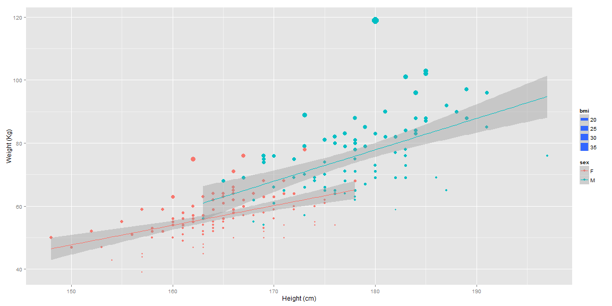

Body Mass Index Calculator
========================================================
author: WhiteFishDontJump
date: 21-August-2015
autosize: true

Why Use the Body Mass Index (BMI) Calculator?
========================================================

- Body Mass Index (BMI) is an quick and easy health check 
      - BMI above or below normal ranges may indicate higher risk for many diseases
- Getting Your Own BMI is quick and easy with the BMI Calculator
- If your BMI is outside of the normal range, then you can
     - learn more about the health implications
     - explore strategies to improve your BMI, if needed.

Variation in BMI: Data from University of York
========================================================
Here is a summary of the calculated BMI, from the 'Davis' dataset (car package),  for 200 British adults who regularly exercise.  The data, in kg and cm, also required conversion to the BMI standard of kilograms per meter$^2$. 


```
 sex         weight          height           bmi       
 F:111   Min.   : 39.0   Min.   :148.0   Min.   :15.82  
 M: 88   1st Qu.: 55.0   1st Qu.:164.0   1st Qu.:20.22  
         Median : 63.0   Median :170.0   Median :21.80  
         Mean   : 65.3   Mean   :170.6   Mean   :22.26  
         3rd Qu.: 73.5   3rd Qu.:177.5   3rd Qu.:23.94  
         Max.   :119.0   Max.   :197.0   Max.   :36.73  
```

BMI data (Davis); linear smooth by gender
========================================================

 
Where would your BMI place you on this plot?

Try BMI Calculator & References
========================================================
Now you can try the BMI Calculator for yourself and follow up with the resources listed here.

- BMI Calculator Shiny App
      - https://whitefishdontjump.shinyapps.io/BMI-calculator
- BMI Wikipedia Article
      - https://en.wikipedia.org/wiki/Body_mass_index
- Centers for Disease Control BMI pages
      - http://www.cdc.gov/healthyweight/assessing/bmi/

**Important End Note: A high or low BMI value may or may not place you at higher risk for diseases.  Best to consult your doctor if your BMI is abnormal.**
